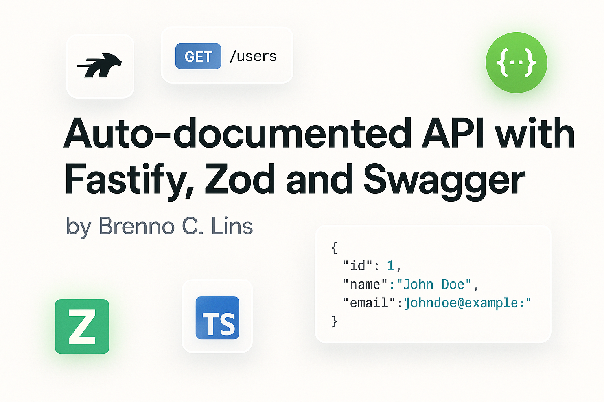
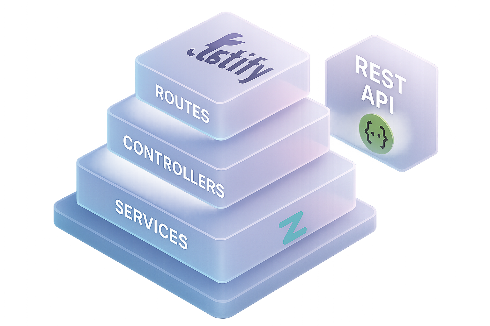
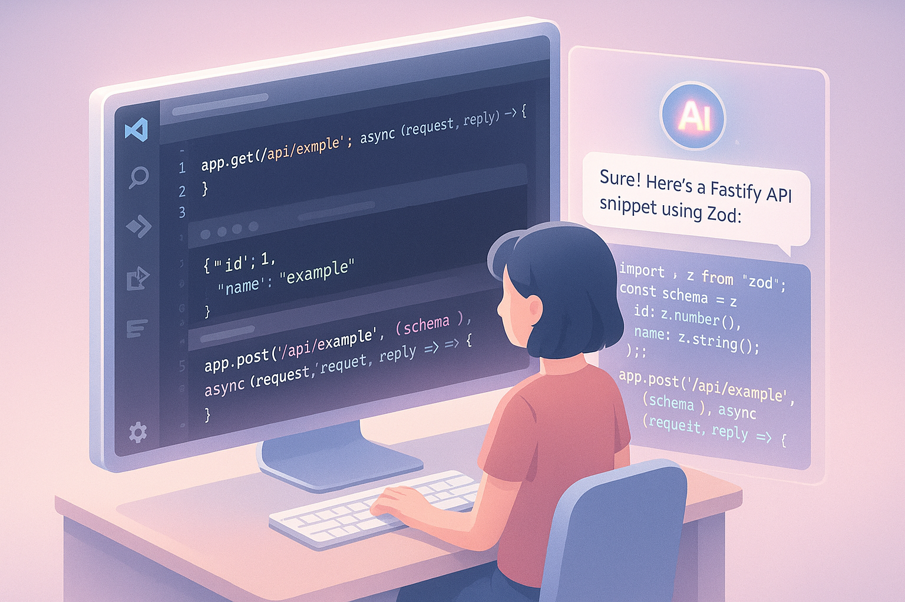
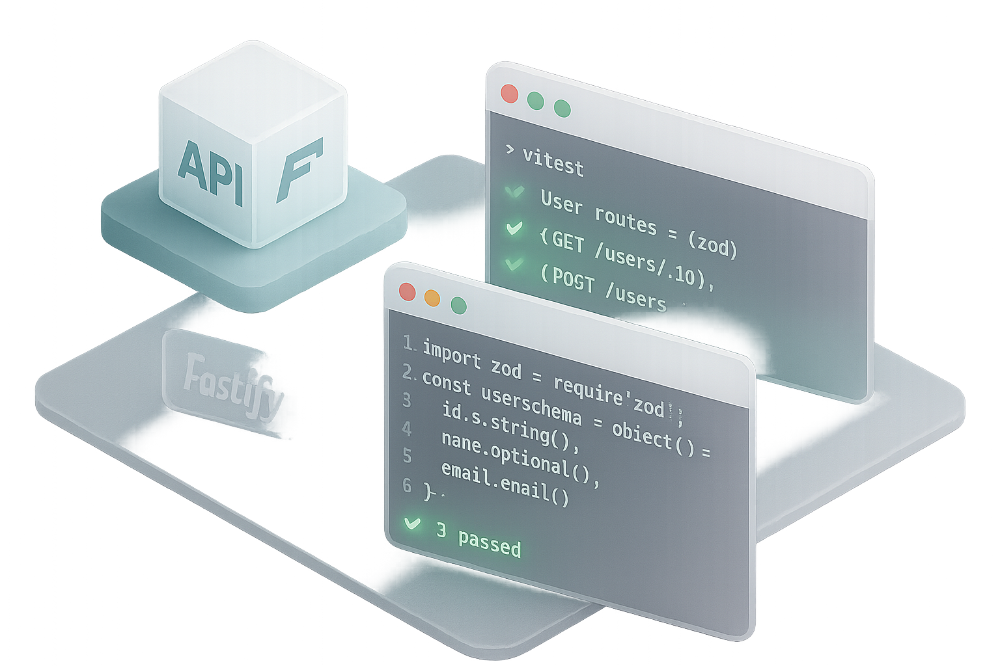

<p align="center">
  
</p>


# 🚀 Criando uma API auto-documentável com Node.js, Fastify, Zod e Swagger

**Autor:** Brenno C. Lins

Este repositório demonstra como construir uma API REST moderna utilizando:

- **Node.js + TypeScript**
- **Fastify v5** como framework HTTP
- **Zod** para validação de dados
- **Swagger/OpenAPI** para documentação automática
- **Biome** para padronização e lint de código
- **Cline** como assistente de codificação com IA


## 🤖 Assistente de IA com Cline

Este projeto está integrado com o [Cline](https://cline.bot), um agente de codificação autônomo baseado em IA que auxilia nas seguintes tarefas:

- Criação de rotas, validações e estrutura de projeto
- Geração e refatoração de código
- Criação de testes, documentação e schemas
- Adoção dos padrões definidos para o time/projeto

As diretrizes estão definidas no arquivo `.clinerules`, localizado na raiz. Ele orienta o comportamento do Cline com regras como:

- Uso de TypeScript com tipagem forte
- Validação com Zod em todas as rotas
- Estilo de código seguindo Biome
- Organização modular (rotas, schemas, services)
- Sem instalação de pacotes sem aprovação

> 💡 Recomendado: instale a extensão do Cline no VS Code, abra o painel e interaja com o projeto para acelerar seu fluxo de trabalho.

<br />
<br />
<br />


<p align="center">
  
  
  
</p>

## ⚙️ Instruções para rodar o projeto

### 🔧 Pré-requisitos

- Node.js instalado (versão 18 ou superior)
- Gerenciador de pacotes `npm` ou `pnpm`
- VS Code (opcional, mas recomendado)

### 📦 Instalação

```bash
git clone https:/github.com/brennoclins/bcl-api-node-swagger.git
cd bcl-api-node-swagger
npm install

```

🚀 Executando o servidor
```
npm run dev
```

A API ficará disponível em:
```
http://localhost:3333
```

📘 Acessando a documentação Swagger
- Após iniciar o servidor, acesse:
```
http://localhost:3333/docs
```

## LINKS

- [Youtube Video](https://www.youtube.com/watch?v=mULWHLquYP0)
